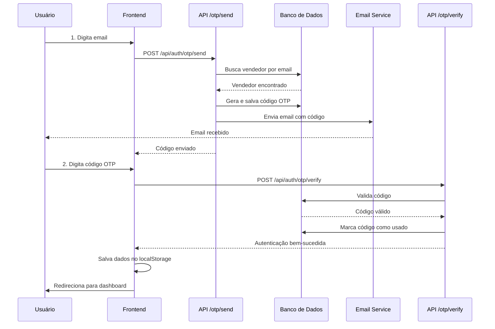

# Sistema de Autenticação OTP para Consultores

## 📋 Resumo

Sistema de autenticação via **OTP (One-Time Password)** por email para a área do consultor. O consultor recebe um código de 6 dígitos no email cadastrado e o utiliza para fazer login, sem necessidade de senha.

---

## 🎯 Funcionalidades

### ✅ Implementado

1. **Envio de Código OTP**
   - Código de 6 dígitos aleatório
   - Validade de 5 minutos
   - Rate limit de 2 minutos entre envios
   - Email customizado com branding da empresa

2. **Verificação de Código**
   - Validação de formato (6 dígitos)
   - Verificação de expiração
   - Limite de 5 tentativas por código
   - Marcação de código como usado após verificação

3. **Interface de Login**
   - Fluxo em 2 etapas (email → código)
   - Timer de reenvio (2 minutos)
   - Feedback visual de sucesso/erro
   - Input otimizado para código numérico

4. **Segurança**
   - Código expira em 5 minutos
   - Código usado apenas uma vez
   - Registro de IP e User Agent
   - Proteção contra força bruta (máx 5 tentativas)

---

## 📊 Estrutura do Banco de Dados

### Tabela: `otp_codes`

```sql
CREATE TABLE otp_codes (
  id INT UNSIGNED AUTO_INCREMENT PRIMARY KEY,
  email VARCHAR(255) NOT NULL,
  code VARCHAR(6) NOT NULL,
  vendedor_id INT NOT NULL,
  expires_at DATETIME NOT NULL,
  verified TINYINT(1) DEFAULT 0,
  verified_at DATETIME DEFAULT NULL,
  attempts INT DEFAULT 0,
  ip_address VARCHAR(45) DEFAULT NULL,
  user_agent TEXT DEFAULT NULL,
  created_at TIMESTAMP DEFAULT CURRENT_TIMESTAMP,
  
  INDEX idx_email (email),
  INDEX idx_code (code),
  INDEX idx_vendedor_id (vendedor_id),
  INDEX idx_expires_at (expires_at),
  INDEX idx_verified (verified),
  INDEX idx_email_code_valid (email, code, verified, expires_at)
)
```

**Campos:**
- `id`: ID único do registro
- `email`: Email do vendedor/consultor
- `code`: Código OTP de 6 dígitos
- `vendedor_id`: ID do vendedor associado (FK para `vendedores.id`)
- `expires_at`: Data/hora de expiração do código
- `verified`: Se o código foi usado (0 = não, 1 = sim)
- `verified_at`: Data/hora da verificação
- `attempts`: Número de tentativas de verificação
- `ip_address`: IP de origem da solicitação
- `user_agent`: User agent do navegador
- `created_at`: Data/hora de criação do registro

---

## 🔌 APIs

### 1. POST `/api/auth/otp/send`

Envia código OTP para o email do consultor.

**Request:**
```json
{
  "email": "consultor@example.com"
}
```

**Response (Sucesso - 200):**
```json
{
  "success": true,
  "message": "Código enviado com sucesso! Verifique seu email.",
  "expiresIn": 300
}
```

**Response (Email não encontrado - 404):**
```json
{
  "success": false,
  "message": "Email não encontrado"
}
```

**Response (Rate limit - 429):**
```json
{
  "success": false,
  "message": "Um código já foi enviado recentemente. Por favor, aguarde 2 minutos antes de solicitar um novo código.",
  "retryAfter": 120
}
```

**Validações:**
- Email é obrigatório
- Formato de email válido
- Email deve existir na tabela `vendedores`
- Rate limit de 2 minutos entre envios

---

### 2. POST `/api/auth/otp/verify`

Verifica código OTP e autentica o consultor.

**Request:**
```json
{
  "email": "consultor@example.com",
  "code": "123456"
}
```

**Response (Sucesso - 200):**
```json
{
  "success": true,
  "message": "Login realizado com sucesso",
  "consultor": {
    "id": 123,
    "name": "João",
    "lastName": "Silva",
    "username": "joao.silva",
    "email": "consultor@example.com",
    "telephone": "11999999999",
    "unidade_id": 5,
    "unidade_nome": "Unidade Centro",
    "unidade_responsavel": "Maria Santos"
  }
}
```

**Response (Código inválido - 401):**
```json
{
  "success": false,
  "message": "Código inválido ou expirado"
}
```

**Response (Código já usado - 401):**
```json
{
  "success": false,
  "message": "Este código já foi utilizado"
}
```

**Response (Código expirado - 401):**
```json
{
  "success": false,
  "message": "Código expirado. Solicite um novo código"
}
```

**Response (Máximo de tentativas - 429):**
```json
{
  "success": false,
  "message": "Número máximo de tentativas excedido. Solicite um novo código"
}
```

**Validações:**
- Email e código são obrigatórios
- Formato de email válido
- Código deve ter 6 dígitos numéricos
- Código não pode estar expirado
- Código não pode ter sido usado
- Máximo de 5 tentativas por código

---

## 📧 Template de Email

O email enviado possui:

- **Logo da empresa** (configurável via banco de dados)
- **Código destacado** em fonte grande e espaçada
- **Tempo de expiração** (5 minutos)
- **Dica de segurança** (nunca compartilhar o código)
- **Design responsivo** e profissional
- **Cores customizáveis** via configuração da empresa

**Exemplo visual:**

```
┌────────────────────────────────────────┐
│         [LOGO DA EMPRESA]              │
│      🔐 Código de Acesso               │
├────────────────────────────────────────┤
│ Olá João Silva,                        │
│                                        │
│ Você solicitou acesso à Área do       │
│ Consultor no Grupo Inteli.            │
│                                        │
│ Use o código abaixo para fazer login: │
│                                        │
│   ┌──────────────────┐                │
│   │   1 2 3 4 5 6    │                │
│   └──────────────────┘                │
│                                        │
│ ⏱️ Este código expira em 5 minutos.   │
│                                        │
│ ⚠️ Dica de Segurança:                 │
│ Nunca compartilhe este código com     │
│ ninguém.                              │
└────────────────────────────────────────┘
```

---

## 🔐 Fluxo de Autenticação



---

## 🖥️ Interface de Login

### Passo 1: Inserir Email
- Campo de email com ícone
- Botão "Enviar Código"
- Feedback de carregamento

### Passo 2: Inserir Código
- Input numérico de 6 dígitos
- Fonte grande e espaçada para facilitar leitura
- Timer de reenvio (2 minutos)
- Botão "Reenviar código" (desabilitado durante timer)
- Botão "Voltar" para trocar email
- Email exibido para confirmação

---

## 📦 Arquivos Criados/Modificados

### Novos Arquivos

1. **`db/migrations/009_create_otp_codes_table.sql`**
   - Migration para criar tabela `otp_codes`

2. **`app/api/auth/otp/send/route.ts`**
   - API para enviar código OTP por email

3. **`app/api/auth/otp/verify/route.ts`**
   - API para verificar código OTP

4. **`scripts/apply-otp-migration.sh`**
   - Script para aplicar migration

5. **`docs/OTP_AUTHENTICATION_SYSTEM.md`**
   - Este arquivo de documentação

### Arquivos Modificados

1. **`lib/email.ts`**
   - Adicionada função `getOTPEmailTemplate()`
   - Removidos logs desnecessários

2. **`app/consultor/login/page.tsx`**
   - Completamente reescrito para suporte a OTP
   - Fluxo em 2 etapas (email → código)
   - Timer de reenvio

---

## 🚀 Como Aplicar

### 1. Configurar Email Gmail

No arquivo `.env.local`, configure:

```env
# Configurações de Email (Gmail SMTP - Obrigatório)
GMAIL_USER=seu-email@gmail.com
GMAIL_PASSWORD=sua-senha-de-app-gmail
EMAIL_FROM=Sistema <seu-email@gmail.com>
```

**⚠️ IMPORTANTE:** Use uma senha de app do Gmail, não a senha da conta:
1. Acesse https://myaccount.google.com/apppasswords
2. Gere uma nova senha de app
3. Use essa senha no `GMAIL_PASSWORD`

### 2. Aplicar Migration

Execute o script:

```bash
chmod +x scripts/apply-otp-migration.sh
./scripts/apply-otp-migration.sh
```

Ou manualmente:

```bash
mysql -h $DB_HOST -P $DB_PORT -u $DB_USER -p$DB_PASSWORD $DB_NAME < db/migrations/009_create_otp_codes_table.sql
```

### 3. Testar o Sistema

1. Acesse: `http://localhost:3000/consultor/login`
2. Digite um email de vendedor cadastrado
3. Clique em "Enviar Código"
4. Verifique o email recebido
5. Digite o código de 6 dígitos
6. Clique em "Verificar e Entrar"

---

## 🔒 Segurança

### Proteções Implementadas

1. **Rate Limiting**
   - Máximo 1 código a cada 2 minutos por email
   - Máximo 5 tentativas de verificação por código

2. **Expiração de Código**
   - Códigos expiram em 5 minutos
   - Códigos usados são marcados e não podem ser reutilizados

3. **Validações**
   - Email deve existir no banco de dados
   - Código deve ter exatamente 6 dígitos
   - Verificação de formato de email

4. **Auditoria**
   - IP de origem registrado
   - User Agent registrado
   - Timestamp de criação e verificação
   - Número de tentativas registrado

### Recomendações Adicionais

- [ ] Implementar CAPTCHA após X tentativas falhas
- [ ] Adicionar logs de segurança detalhados
- [ ] Implementar bloqueio temporário após muitas tentativas
- [ ] Adicionar notificação de login suspeito
- [ ] Implementar 2FA adicional para operações sensíveis

---

## 📊 Monitoramento

### Queries Úteis

**Códigos ativos nos últimos 30 minutos:**
```sql
SELECT 
  email,
  code,
  verified,
  attempts,
  expires_at,
  created_at
FROM otp_codes
WHERE created_at > DATE_SUB(NOW(), INTERVAL 30 MINUTE)
ORDER BY created_at DESC;
```

**Taxa de sucesso de autenticação:**
```sql
SELECT 
  DATE(created_at) as data,
  COUNT(*) as total_codigos,
  SUM(verified) as codigos_verificados,
  ROUND(SUM(verified) / COUNT(*) * 100, 2) as taxa_sucesso
FROM otp_codes
WHERE created_at > DATE_SUB(NOW(), INTERVAL 7 DAY)
GROUP BY DATE(created_at)
ORDER BY data DESC;
```

**Tentativas excessivas (possível ataque):**
```sql
SELECT 
  email,
  COUNT(*) as total_tentativas,
  SUM(attempts) as tentativas_totais,
  MAX(attempts) as max_tentativas_codigo
FROM otp_codes
WHERE created_at > DATE_SUB(NOW(), INTERVAL 1 HOUR)
GROUP BY email
HAVING total_tentativas > 10 OR max_tentativas_codigo >= 5
ORDER BY total_tentativas DESC;
```

**Códigos expirados não utilizados:**
```sql
SELECT 
  COUNT(*) as total,
  DATE(created_at) as data
FROM otp_codes
WHERE verified = 0
  AND expires_at < NOW()
  AND created_at > DATE_SUB(NOW(), INTERVAL 7 DAY)
GROUP BY DATE(created_at)
ORDER BY data DESC;
```

---

## 🧹 Manutenção

### Limpeza de Códigos Antigos

Recomenda-se executar periodicamente:

```sql
-- Deletar códigos com mais de 7 dias
DELETE FROM otp_codes
WHERE created_at < DATE_SUB(NOW(), INTERVAL 7 DAY);
```

Pode-se criar um cron job para isso:

```javascript
// scripts/cleanup-otp-codes.js
import { executeQuery } from '@/lib/database'

async function cleanupOldOTPCodes() {
  const result = await executeQuery(`
    DELETE FROM otp_codes
    WHERE created_at < DATE_SUB(NOW(), INTERVAL 7 DAY)
  `)
  
  console.log(`Códigos OTP antigos removidos: ${result.affectedRows}`)
}

cleanupOldOTPCodes()
```

---

## 🐛 Troubleshooting

### Email não está sendo enviado

1. Verifique configurações do Gmail:
   ```bash
   echo $GMAIL_USER
   echo $GMAIL_PASSWORD
   ```

2. Certifique-se de usar senha de app (não senha da conta)

3. Verifique se verificação em 2 etapas está ativada

4. Teste envio manual:
   ```bash
   curl -X POST http://localhost:3000/api/auth/otp/send \
     -H "Content-Type: application/json" \
     -d '{"email":"seu-email@example.com"}'
   ```

### Código sempre inválido

1. Verifique se o código não expirou (5 minutos)

2. Certifique-se de estar usando o código mais recente

3. Verifique timezone do servidor:
   ```sql
   SELECT NOW(), expires_at 
   FROM otp_codes 
   ORDER BY created_at DESC 
   LIMIT 1;
   ```

### Rate limit muito restritivo

Ajuste o tempo em `app/api/auth/otp/send/route.ts`:

```typescript
// De 2 minutos para 1 minuto
AND created_at > DATE_SUB(NOW(), INTERVAL 1 MINUTE)
```

---

## 📝 Checklist de Qualidade

- [x] Zero console.logs
- [x] Zero código comentado
- [x] Zero imports não usados
- [x] Zero erros TypeScript
- [x] Error handling presente
- [x] Props tipadas
- [x] Validação de entrada
- [x] SQL injection prevention (prepared statements)
- [x] Rate limiting implementado
- [x] Auditoria (IP, User Agent)
- [x] Feedback visual (loading, errors, success)
- [x] UX otimizada (timer, reenvio, etc)

---

## 🎨 Melhorias Futuras

- [ ] Suporte a múltiplos idiomas
- [ ] Opção de receber código via SMS
- [ ] Notificação push no celular
- [ ] Histórico de acessos do consultor
- [ ] Dashboard de métricas de autenticação
- [ ] Testes automatizados (Jest, Playwright)
- [ ] Modo de desenvolvimento com código fixo (123456)
- [ ] Integração com serviços de autenticação (Auth0, Firebase)

---

## 📄 Licença

Este sistema faz parte do projeto Dash Inteli e segue a mesma licença do projeto principal.

---

**Última atualização:** 15 de Dezembro de 2024
**Versão:** 1.0.0
**Autor:** Sistema Dash Inteli

